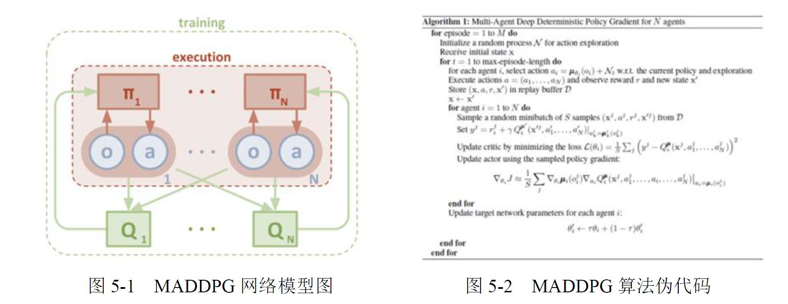

# CSMA-CA-simulation and RL enhancement
 Python interpretation of CSMA-CA and enhancement by using Reinforcement Learning

# 项目背景
本项目为上海交通大学《无线通信原理与移动网络》（(2021-2022-2)-IE304-1）课程大作业，由朱首行、陈景浩、梁子达、张芊四人小组合作完成。

# 项目介绍
    Project 7. 无线信道冲突避免  

    无线局域网为了避免通信设备在传输数据时发生冲突，通常采用CSMA/CA 协议以协调各设备的传输时间。然而，CSMA/CA 协议并不能完全避免冲突的发生，而且由于要在各设备传输数据之前设置等待窗口而降低了通信效率。目前已经有研究将多智能体强化学习应用于信道规划中，以提高整体系统的通信效率为目标，各设备将学习到各自最佳的传输时间。本项目将利用模拟仿真的方式搭建一套通信系统，分别利用CSMA/CA 协议与多智能体强化学习模型达到避免设备间发生冲突的目的，并进一步比较两者对通信系统整体性能的提升程度。  

    要求：
    1.搭建通信系统（多个设备，发送的消息具有不同的大小与优先级等），将CSMA/CA 协议应用于该系统并进行性能测试（50%）
    2. 搭建多智能体强化学习模型，将其用于（1）中的通信系统并进行性能测试（50%）
    3. 与Proj 8 合作，探究在假定各设备能较为准确地预测未来信道占用情况的前提下，多智能体强化学习模型的效果是否能进一步提升（+20%）

在本项目中，基于CSMA/CA协议，我们使用 python搭建了一个无线通信系统，并实现了对 CSMA/CA协议内容的模拟与仿真。我们将多智能体强化学习（ MARL）算法MADDPG引入通信系统中，还尝试了将多智能体强化学习降维为单智能体强化学习， 在通信系统中实现了 Q learning、 Sarsa等算法，使系统性能在传输延迟、丢包率、重传率等多个方面得到提升。

# 项目分工
陈景浩：CSMA-CA协议的仿真与实现，代码架构理解与接口介绍。  
朱首行：RL的学习、应用，多智能体强化学习研究，汇报PPT制作。  
梁子达：RL的学习、应用，单智能体强化学习研究。  
张芊：项目报告的撰写。 

# 成果介绍
① 我们构建了一个完整应用 CSMA/CA协议的通信系统，且该通信系统绝大数参数可以由使用者更改。  
② 我们复现了多智能体强化学习算法 MADDPG，并验证了其在改进通信系统性能上的可行性。  
③ 我们自行尝试了将多智能体强化学习模型降维为单智能体模型，并验证了该方法在此项目中的可行性，结果显示该方法较大幅度地改善了通信系统性能。

# 不足与展望
① 通信系统仿真运行效率不够高，在 12700 CPU下运行一次 100秒仿真需要五十分钟左右的时间。  
② 由于时间较为紧张，且对大规模节点的仿真较为耗时，因此在对 CSMA/CA的仿真中，我们均设定节点数为 4。在后续的实验中，可以考虑将节点数调整至10或以上，观察CSMA/CA对大规模节点的仿真情况并进行性能对比。  
③ 由于计算资源的限制，现有的多智能体强化学习算法只尝试了 MADDPG这一种policy base的算法，且并未尝试 VDN、 QMIX等 value base算法。  
④ 对于大规模群体问题，有 MFMARL（基于平均场理论的多智能体强化学习）可以进行简化，但由于我们未上升到大规模系统，故并未进行尝试 。（相关论文链接： https://arxiv.org/abs/1802.05438v4）

# 项目的代码结构

项目更细致的代码结构请参考'structure.md'。  

# 进一步讨论
有关更细致的讨论与代码实现，可移步：'project7-无线信道冲突避免（1）-朱首行，陈景浩，梁子达，张芊.pdf'。

# 参考代码与文献
[1] Riccardomicheletto, Computer Science student at University of Trento, Discrete event simulator for the 802.11 CSMA/CA DCF.
https://github.com/riccardomicheletto/SPEproject-802.11DCFsim    

[2]Zhiyuan Jiang,Member,IEEE,Yan Liu,Jernej Hribar,Luiz A. DaSilva,Fellow,IEEE,
Sheng Zhou,Member,IEEE,and Zhisheng Niu,Fellow,IEEE. SMART: Situationally-Aware Multi-Agent Reinforcement Learning-Based Transmissions. https://ieeexplore.ieee.org/stamp/stamp.jsp?tp=&arnumber=9386228  

[3] 童 乐，梁 涛，张 余 ，钱鹏智. 基于多智能体强化学习的动态频谱分配方法. http://www.opticsjournal.net/Articles/OJ6e19483e60fcd2d9/Abstract  
