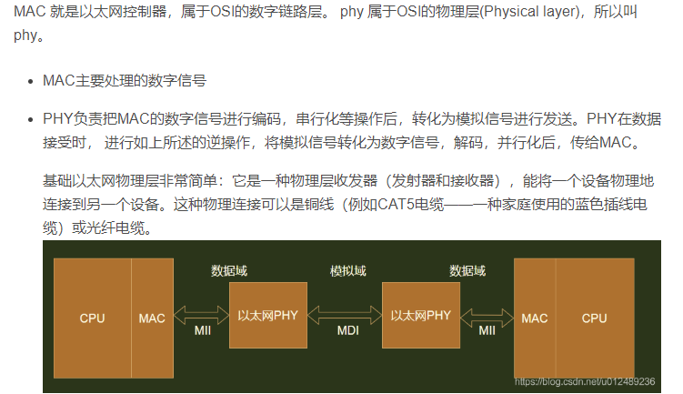
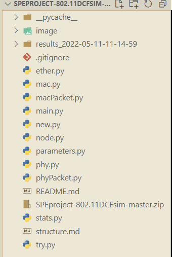
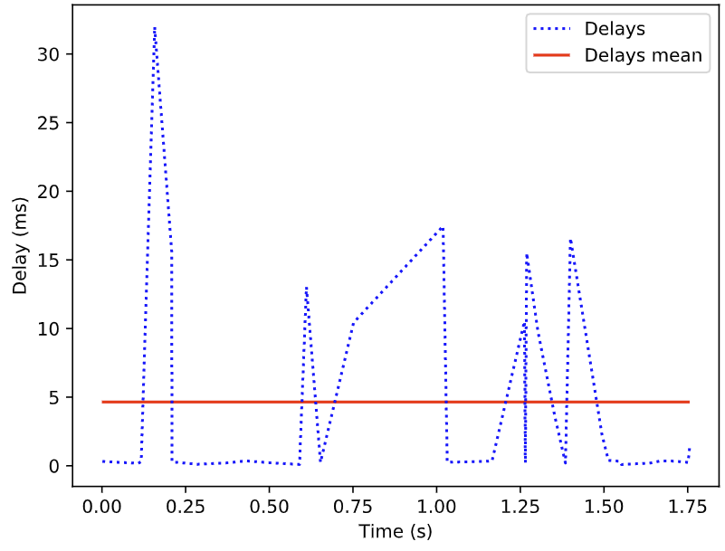
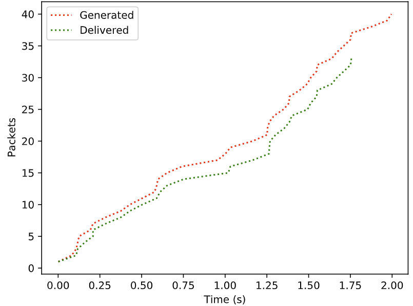
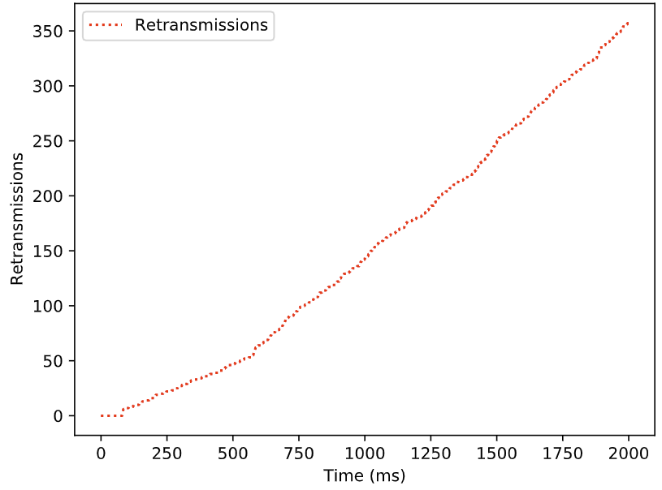
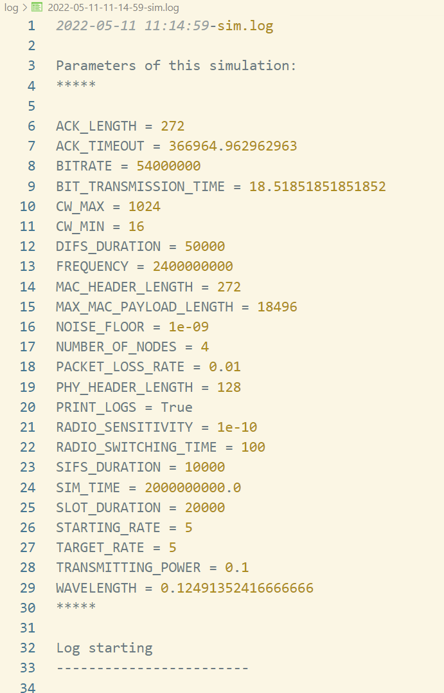
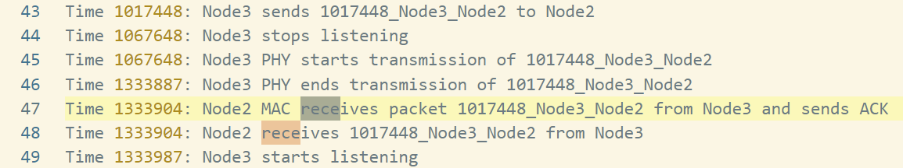

# 项目依赖库

python 3.6 ，建议新建一个虚拟环境来运行本项目

conda create -n py36 python=3.6

conda activate py36

pip install simpy scipy

应该就这两个，别的差什么就pip自己安装就是

# MAC与PHY介绍



# 文件目录



## results文件夹：程序结果输出的目标文件夹

程序正常结束后，会输出pdf图。

results文件文件名包含了程序的开始运行时间。

### delays5.pdf

收发包的延迟情况。



### packets5.pdf

收发包的数量情况。



### retransmission5.pdf

重传包的数量累计。




### simulation.log：程序的控制台输出

程序的控制台输出（print）我已经重定向到同时在log文件与cmd输出。

log文件头部为程序的开始运行时间和本次运行的参数记录，来自parameters.py，再后面就是节点行为记录。



## parameters.py：程序的超参数设定

关键参数为下面6个：

-SIM_TIME=2*1e9 单位为纳秒，也就是2秒。此参数不能调整至1e9（1秒）以下，会导致程序报错。设定SIM_TIME=2*1e9时，本程序运行时间约2小时多点。研究了一下，这个用的simpy库做的离散时间事件仿真，不支持异步，无法进一步加速。

-NUMBER_OF_NODES=4 节点数暂时设定为4，调大此参数会导致程序的运行时间增加。程序默认每个节点都同时具有收发功能。

-PACKET_LOSS_RATE 丢包率

-BITRATE 比特率。若想程序运行的更快，可以减小比特率，相当于提升每个事件的持续时间与间隔时间，减小总事件数，在客观上可以加速程序运行。可用于程序的调试过程。

-NOISE_FLOOR 底噪。噪声基底（Noise floor）指的是接收信噪比为0dB时，接收机能够感知的最小信号强度。

-FREQUENCY 频率。

别的一些参数大部分是CSMA-CA协议设定的或是行业内常用参数，几乎不需要调整。

STARTING_RATE=5

TARGET_RATE=5

这两个是啥？根据readme，“默认情况下，模拟器执行传输随机大小和内容的数据包，从每个节点发送到随机目的地，使用一个速率增加的泊松过程。初始速率和最终速率都是可编辑的参数。”此处把初值和终值都设定为5，相当于是一个固定值。

原始参数配置记录备忘：

> ```
> from scipy.constants import c
> # c为光速
>
> # NB: sim time are nanoseconds, distances are in meters, powers in watt
>
> # 802.11g parameters. 802.11g is the last standard not adopting MIMO. MIMO boost bitrate
> # using concurrent transmissions and other techniques. Values from wikipedia
> # https://en.wikipedia.org/wiki/IEEE_802.11
> # https://en.wikipedia.org/wiki/DCF_Interframe_Space
> # https://en.wikipedia.org/wiki/Short_Interframe_Space
> # Freq: 2.4 GHz, OFDM, 20 MHz bandwidth, 54 Mbit/s
>
> ### SIMULATION PARAMETERS
> SIM_TIME = 2*1e9
>
> PRINT_LOGS = True
> NUMBER_OF_NODES = 4
> STARTING_RATE = 5
> TARGET_RATE = 5
>
> ### RADIO PARAMETERS
> TRANSMITTING_POWER = 0.1 # Watt, legal limit in EU for EIRP
> RADIO_SWITCHING_TIME = 100
> RADIO_SENSITIVITY = 1e-10 # power under which signal is not sensed
>
>
> ### SIGNAL PARAMETERS
> FREQUENCY = 2400000000 # 2.4 GHz
> WAVELENGTH = c/FREQUENCY
>
> ### PHY PARAMETERS
> BITRATE = 54000000 # 54 Mbit/s, 802.11g 20 MHz channels
> BIT_TRANSMISSION_TIME = 1/BITRATE * 1e9
> NOISE_FLOOR = 1e-9
> PHY_HEADER_LENGTH = 128
> PACKET_LOSS_RATE = 0.01 # 1% of packets are corrupted
>  
> ### MAC PARAMETERS
> SLOT_DURATION = 20000 # 20 microseconds, 802.11g 2.4 GHz
> SIFS_DURATION = 10000 # 10 microseconds, 802.11g 2.4 GHz
> DIFS_DURATION = SIFS_DURATION + (2 * SLOT_DURATION)
> MAC_HEADER_LENGTH = 34*8 # 34 byte fixed fields of a mac packet
> MAX_MAC_PAYLOAD_LENGTH = 2312*8
> ACK_LENGTH = MAC_HEADER_LENGTH
> CW_MIN = 16
> CW_MAX = 1024
> # ack timeout = transmission time of biggest possible pkt + rtt for 300m distance + sifs + ack transmission time
> ACK_TIMEOUT = (MAX_MAC_PAYLOAD_LENGTH + MAC_HEADER_LENGTH + PHY_HEADER_LENGTH) * BIT_TRANSMISSION_TIME + 2 * round((300 / c) * pow(10, 9), 0) + SIFS_DURATION + ACK_LENGTH * BIT_TRANSMISSION_TIME
>
> # CJH 2022/5/11
> def get_attrs(li):
>     attrs = []
>     s='Parameters of this simulation:\n*****\n\n'
>     for attr in li:
>         if attr.isupper():
>             attrs.append(attr)
>     for attr in attrs:
>         s+=attr+' = '+str(eval(attr))+'\n'
>     return attrs,s+'*****\n'
>
> attrs,s=get_attrs(dir())
> # CJH 2022/5/11
> ```

## stats.py

用于作图与生成结果PDF文件

## ether.py

环境的定义、距离计算、传输延迟和信号衰减的引入

## mac.py/macpacket.py/phy.py/phypacket.py

mac和phy层的类定义。

其中的关键行为基本上都有注释。

程序控制台的输出也主要来源于这里。

## node.py：节点类定义

keepSendingIncreasing是核心函数。

## main.py：主程序

顶层很好懂，也有相关注释。

# 程序的控制台输出



一次完整、不出错、不重传的工作过程如上。

输出格式：Time 当前时间: 事件发生者 PHY/MAC 事件行为 事件创建时的时间_事件发生者_事件接收者

这些输出的源代码基本上全在mac.py/phy.py中，英文也写的很好懂。
